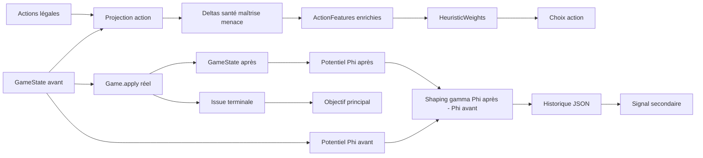

# Récompenses d’état et avantages différentiels du HeuristicPlayer — Architecture

**Statut : proposé** — Architecture préalable à l’implémentation.

## Objective

Améliorer la direction donnée au `HeuristicPlayer` en ajoutant des signaux intermédiaires à la
victoire ou à la défaite : avantage de points de vie, pression sur les champions adverses et
avantage de maîtrise.

La victoire reste l’objectif principal. Ces signaux doivent rendre les choix moins myopes et
fournir à l’optimiseur un signal plus informatif lorsque deux profils ont des taux de victoire
proches.

## Current State

- `HeuristicPlayer` choisit une action légale selon un produit scalaire de `ActionFeatures` et
  `HeuristicWeights`.
- Les features actuelles décrivent principalement les effets immédiats : dégâts, Power, Gems,
  maîtrise, santé, pioche, champions et contraintes.
- `terminal_win` et `lethal` ont une priorité indépendante dans le classement.
- Le joueur ne simule pas l’action et ne reçoit qu’une `GameState` détachée et les actions légales.
- `Game.clone()` existe, mais aucune API publique ne fournit encore un état résultant d’une action
  sans modifier la partie réelle.
- Le profil v002 atteint environ 51,5 % contre `RandomPlayer` sur une réévaluation fraîche, contre
  32 % pour la baseline. La phase mixte contre l’ancienne heuristique reste à faire.

## Target Behavior

Pour chaque action candidate, l’heuristique doit pouvoir valoriser :

- l’évolution de l’avantage de santé entre les joueurs ;
- l’évolution de l’avantage de maîtrise ;
- la réduction de la menace représentée par les champions adverses ;
- l’évolution de ces signaux sur une transition, sans perdre la priorité d’une victoire immédiate.

La campagne doit également calculer une récompense intermédiaire par transition, tout en conservant
la victoire/défaite comme métrique principale d’acceptation d’un profil.

## Schéma d’architecture



## Non-Goals

- Faire primer une bonne santé finale sur une victoire immédiate.
- Transformer le moteur en environnement d’apprentissage général ou ajouter un réseau neuronal.
- Récompenser le simple fait de conserver un champion sans tenir compte de sa menace réelle.
- Utiliser uniquement le shaping pour déclarer un profil meilleur que la baseline.
- Ajouter une information cachée à l’observation du joueur.

## Key Decisions

1. **Deux niveaux de signal.** Les features enrichies servent au choix d’action ; la récompense de
   transition sert à l’évaluation et au diagnostic. Une métrique facile à optimiser n’est pas
   nécessairement un bon objectif de victoire.

2. **Avantages différentiels normalisés.** Les valeurs seront calculées comme des écarts puis des
   variations avant/après :

   ```text
   health_advantage(s)  = (ma_santé - santé_adverse) / 50
   mastery_advantage(s) = (ma_maîtrise - maîtrise_adverse) / 30
   delta(action)        = valeur_après - valeur_avant
   ```

   La normalisation évite qu’un nombre de points de vie domine mécaniquement la maîtrise.

3. **Menace champion statique en V1.** La menace d’un joueur est simplement calculée comme le
   nombre de champions présents multiplié par un coefficient fixe :

   ```text
   champion_threat(player) = champion_presence_weight * len(player.champions)
   champion_presence_weight = 1.0 en V1
   ```

   Pour conserver une échelle comparable aux autres composantes, l’avantage utilisé dans `Phi` est
   `clamp((menace_moi - menace_adverse) / champion_threat_scale, -1, 1)`, avec
   `champion_threat_scale = 4.0` en V1. Cette échelle reste fixe pendant toute une campagne ; elle
   n’est pas annealée avec `alpha`. La menace adverse diminue donc lorsqu’un champion est
   détruit, sans différenciation selon sa capacité, sa passive ou son impact stratégique. Ces
   raffinements sont reportés à une évolution ultérieure.

4. **Projection partielle en V1.** La V1 projettera les effets déclaratifs déjà connus : dégâts,
   santé, maîtrise et destruction de champions. Une action dont le delta ne peut pas être projeté
   reçoit un delta nul et est marquée comme non projetée dans le diagnostic ; elle ne reçoit pas une
   pénalité arbitraire. Une V2 pourra exposer `Game.preview(action)`, fondé sur `Game.clone()` puis
   `Game.apply()` sur une copie.

5. **Récompense potentielle.** Le shaping utilisera :

   ```text
   Phi(s) = w_health * health_advantage(s)
          + w_mastery * mastery_advantage(s)
          + w_champion * champion_threat_advantage(s)

   shaping(s, a, s') = gamma * Phi(s') - Phi(s)
   ```

   Cette forme récompense une amélioration et punit sa dégradation. `gamma = 1.0` en V1 ; une
   valeur différente relève d’une évolution séparée.

6. **Victoire prioritaire.** L’ordre d’optimisation reste victoire, utilité
   victoire/nulle/défaite, puis shaping comme signal secondaire. Une formule exploratoire peut être
   `objectif = résultat_terminal + alpha(batch) * moyenne_shaping`, avec un `alpha` assez petit pour
   qu’un avantage de santé ne compense jamais une défaite. `alpha` décroît par batch et vaut zéro
   pour la validation finale, qui compare obligatoirement les taux de victoire.

7. **Pas de récompense brute par tour.** Additionner les points de vie ou la maîtrise à chaque tour
   favoriserait les parties longues et pourrait récompenser un joueur qui ne conclut jamais. Le
   shaping par différence de potentiel évite ce biais.

8. **Poids séparés.** Les coefficients qui dirigent la politique restent dans `HeuristicWeights`.
   Les poids du potentiel de campagne sont dans une configuration `StateRewardWeights` distincte.

9. **Annealing du shaping.** Les poids de shaping commencent avec une valeur fixe non nulle pour
    orienter la recherche vers des états raisonnables, puis diminuent selon un calendrier déterministe
    au fil des batches. Les candidats d’un même batch utilisent exactement le même poids. La
    validation finale et la sélection publiée utilisent un poids de shaping nul.

10. **Calendrier explicite.** La valeur de shaping dépend de la progression globale de la campagne,
    jamais des performances du candidat courant. Une forme initiale recommandée est
    `alpha(batch) = alpha_0 * (1 - progression)`, avec un plancher nul à la fin. Tous les profils
    d’un même batch utilisent le même `alpha`. `champion_threat_scale` reste inchangé ; il ne peut
    être recalibré qu’entre deux campagnes.

12. **Granularité des transitions.** Une transition est calculée après chaque `Game.apply()`, puis
    agrégée par tour et par partie pour le diagnostic. Le shaping potentiel ne récompense pas le
    nombre d’actions : les gains et pertes de potentiel intermédiaires se compensent. La V1 utilise
    `gamma = 1.0` afin d’éviter tout biais supplémentaire en faveur des parties longues.

13. **Échelle initiale prudente.** Les trois composantes du potentiel sont normalisées dans
    `[-1, 1]` et reçoivent des poids égaux : `w_health = 1/3`, `w_mastery = 1/3` et
    `w_champion = 1/3`. Le potentiel reste donc dans `[-1, 1]`. Le facteur initial de shaping est
    `alpha_0 = 0.10`, puis décroît linéairement jusqu’à zéro. La contribution maximale du shaping
    reste ainsi inférieure à l’écart d’une victoire (`1.0`) et ne peut pas rendre une défaite
    préférable à une victoire.

## Open Questions

- **Non bloquante :** la valeur de `champion_threat_scale` pourra être recalibrée entre deux
  campagnes selon le taux de valeurs saturées et les percentiles observés. La valeur initiale de
  `4.0` est un choix d’échelle, pas une règle du jeu.
- **Non bloquante :** une évolution ultérieure pourra remplacer la projection partielle par
  `Game.preview(action)` si le gain de précision justifie le coût CPU.

## Proposed Architecture

### Évaluation d’état

Ajouter `shards_ai/ai/state_evaluator.py` pour calculer depuis une `GameState` observable :

- `health_advantage` normalisé ;
- `mastery_advantage` normalisé ;
- `champion_threat_advantage` ;
- le potentiel `phi` avec une configuration immuable.

Ce module ne connaît aucune stratégie et ne mute jamais l’état.

### Projection des actions

Étendre `shards_ai/ai/heuristic_features.py` avec des deltas signés :

| Feature | Positive lorsque | Source initiale |
|---|---|---|
| `health_advantage_delta` | l’écart de santé devient meilleur | dégâts, santé gagnée/perdue |
| `mastery_advantage_delta` | l’écart de maîtrise augmente | maîtrise gagnée et seuils |
| `opponent_threat_delta` | la menace adverse diminue | nombre de champions adverses détruits |
| `self_threat_delta` | la menace de ses champions augmente | champion joué |

Les deltas signés évitent le double signe actuel des pénalités : un coefficient positif récompense
une progression et un coefficient négatif la punit. Chaque projection expose également un indicateur
`projection_supported` pour distinguer un vrai delta nul d’une opération non couverte.

### Récompense de transition

Ajouter `shards_ai/analysis/reward_shaping.py` pour :

1. prendre les snapshots avant/après chaque `Game.apply()` dans le runner ;
2. calculer `Phi` et `gamma * Phi(after) - Phi(before)` ;
3. enregistrer seed, tour, action, joueur et récompense ;
4. agréger moyenne, médiane, somme par partie et corrélation avec l’issue finale.

L’instrumentation reste désactivable dans les campagnes normales.

### État après action exact

Une évolution moteur pourra exposer :

```python
after_state = game.preview(action)
```

`preview` clonera la partie, appliquera l’action sur la copie avec la source d’aléatoire copiée,
puis retournera un état détaché. La partie originale et son RNG devront rester inchangés. Cette
API sera plus fiable qu’une reconstruction des règles dans l’IA, mais plus coûteuse en CPU et donc
optionnelle dans le hot path.

## Data Model

`ActionFeatures` reçoit les deltas normalisés et `HeuristicWeights` les coefficients correspondants.
Une configuration distincte `StateRewardWeights` contiendra au minimum :

- `health_advantage_weight: 1/3` ;
- `mastery_advantage_weight: 1/3` ;
- `opponent_threat_weight: 1/3` ;
- `champion_presence_weight: 1.0` ;
- `champion_threat_scale: 4.0` ;
- `gamma: 1.0` ;
- `initial_alpha: 0.10` ;
- issue terminale : victoire `1.0`, nulle `0.5`, défaite `0.0`.

Les rapports JSON ajouteront par partie et par batch `mean_shaping`, `final_phi`, `health_delta`,
`mastery_delta` et `champion_threat_delta`, séparément par adversaire.

## Backend Flow

```text
observation + legal_actions
        |
        v
projection de chaque action
        |
        v
features immédiates + deltas d’état
        |
        v
score HeuristicPlayer -> action choisie
        |
        v
transition réelle Game.apply()
        |
        v
snapshot après action -> shaping et métriques
        |
        v
issue terminale + historique de campagne
```

La projection et la transition réelle doivent être comparées dans des scénarios courts. La
projection sert au choix de l’action, tandis que les snapshots réels servent au shaping de la
campagne. Toute divergence connue doit être signalée comme approximation.

## Testing Strategy

- Tester les avantages de santé et de maîtrise avec écarts positifs, négatifs et nuls.
- Tester qu’infliger des dégâts augmente `health_advantage_delta` et perdre de la santé le diminue.
- Tester qu’un gain de maîtrise augmente le delta correspondant.
- Tester les états avec zéro, un et plusieurs champions ; la valeur dépend uniquement du nombre.
- Tester le déterminisme et l’absence de mutation de l’observation.
- Tester le potentiel : progression positive, régression négative et transition neutre nulle.
- Tester que le shaping ne peut pas battre une victoire terminale dans le classement.
- Tester les opérations non supportées et leur comportement documenté.
- Si `Game.preview()` est ajouté, tester l’absence de mutation du jeu original et de son RNG.
- Comparer les profils sur seeds fraîches contre random et référence heuristique, avec `alpha = 0`
  pour l’acceptation finale et en séparant métriques terminales et shaping.

## Rollout And Migration

1. Ajouter l’évaluation d’état et les tests sans modifier les coefficients actifs.
2. Ajouter les deltas de projection et activer leur logging en mode expérimental.
3. Comparer sans shaping, avec features d’action, puis avec shaping de campagne à budget égal.
4. Réoptimiser les coefficients de décision avec les nouveaux signaux.
5. Valider contre `RandomPlayer` et la référence heuristique avant de publier un nouveau YAML.
6. Garder `v002` comme profil de rollback.

## Files Expected To Change

- `shards_ai/ai/heuristic_evaluator.py` — nouveaux champs et coefficients d’action.
- `shards_ai/ai/heuristic_features.py` — projection et deltas d’action.
- `shards_ai/ai/state_evaluator.py` — potentiel d’état, nouveau module proposé.
- `shards_ai/analysis/reward_shaping.py` — récompense de transition, nouveau module proposé.
- `shards_ai/game/game.py` — éventuellement `preview(action)`.
- `shards_ai/optimization/heuristic.py` — objectif secondaire et métriques shaping.
- `configs/heuristic_profiles/*.yaml` — profils après validation.
- `tests/game/`, `tests/analysis/` et `tests/optimization/` — scénarios et campagnes.
- `doc/Current state/Heuristic player.md` — après implémentation effective uniquement.
